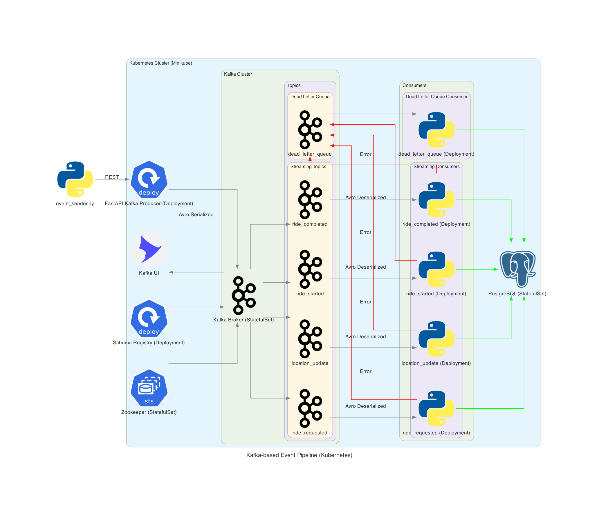

1. Start the infrastructure: `docker-compose up -d`. This will spin up the following services:
   - `postgres`: PostgreSQL database in which the data will be stored.
   - `zookeeper`: Zookeeper for managing Kafka brokers.
   - `kafka`: Kafka broker for message streaming.
   - `schema-registry`: Confluent Schema Registry for managing Avro schemas.
   - `kafka-ui`: Kafka UI for monitoring Kafka topics and messages.
   - Consumers, that will consume messages from Kafka topics, process them and store them in the PostgreSQL database.
2. Install `uv` and sync the environment: `uv sync`.
3. Create tables in the database. Use `scripts/sql/create_tables.sql` to create the necessary tables in the PostgreSQL database.
4. Populate the database with drivers and passengers. Use `scripts/sql/generate_drivers_passengers.py` 
to populate the database with sample data.
5. Run the Kafka producer with the command `uv run producers/producer.py`. This will start producing messages to the Kafka topics.

